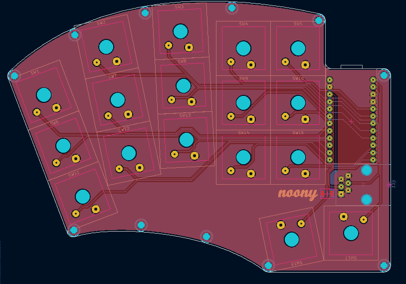

# noony

The noony is an attempt at making a comfy keyboard.  

* Keyboard Maintainer: [tom sadowski](https://github.com/tomsadowski)   
* Hardware Supported: AVR promicro type shit  
* Hardware Availability: the usual spots that show up when you google electronics  
